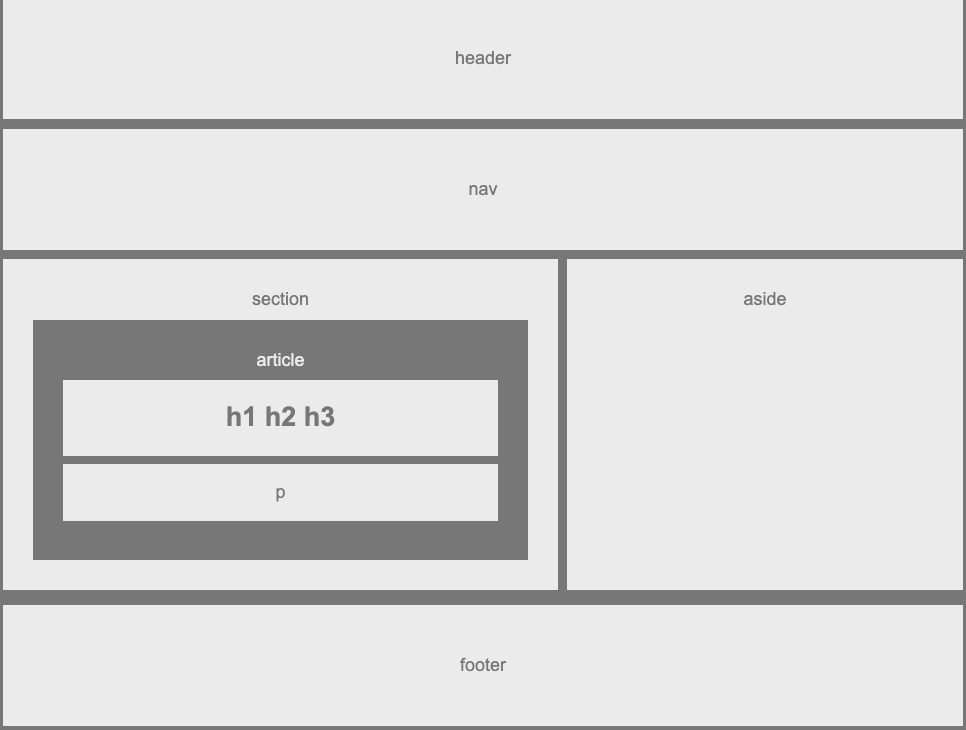

# HW-Wireframe

## First Bootcamp Homework.

### A Web Design Skeleton to show the different sections of HTML and styling it using CSS.

## Built with :

* [HTML](https://www.w3schools.com/html/html_intro.asp) 
* [CSS](https://www.w3schools.com/css/default.asp)

## Authors

* Raghav Shiv
